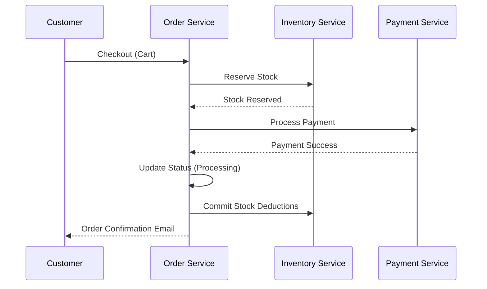
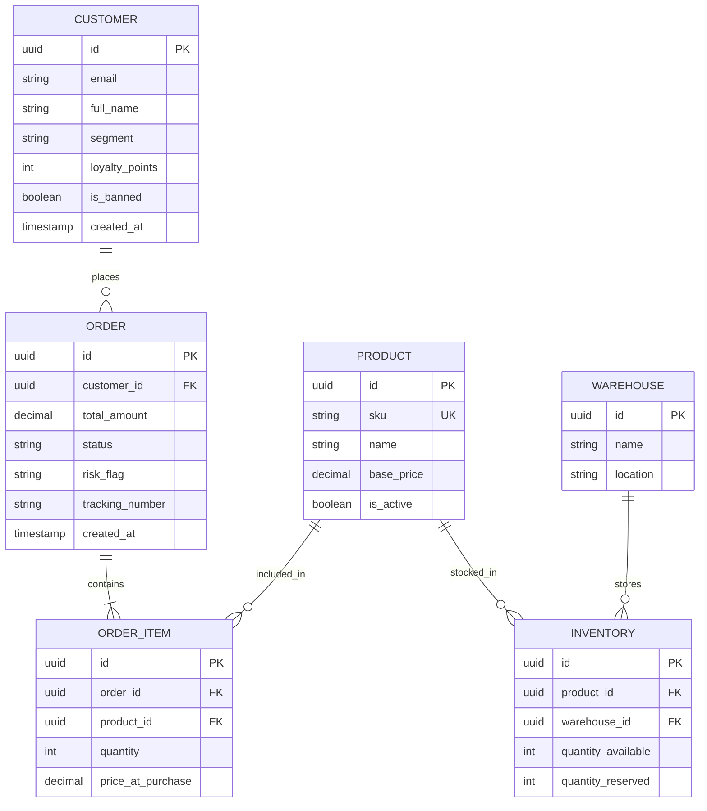
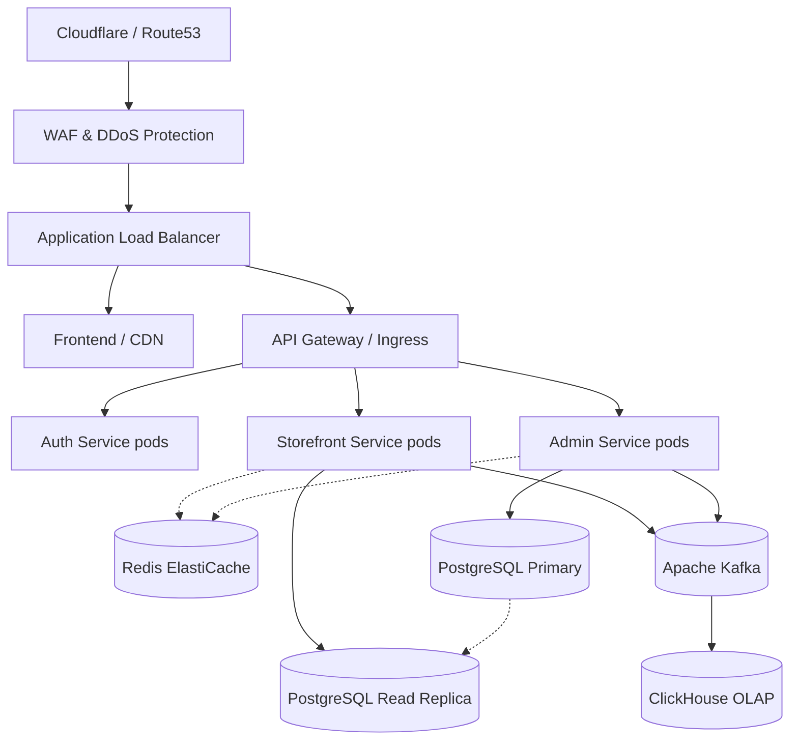

# Enterprise Backend Architecture Blueprint
**Project: ATELIER Premium Fashion E-Commerce**

> [!IMPORTANT]
> **Executive Summary**
> This document provides a complete production-grade backend architecture blueprint for the ATELIER application. It reverses engineers the business domain from the existing React frontend, establishes the database schema, defines the microservice boundaries, and provides a roadmap for a senior engineering team to implement a highly scalable backend supporting up to 1M+ active users.

---

## PHASE 1: COMPLETE FRONTEND ANALYSIS

The frontend is a monolithic React SPA (Vite, Zustand, React Router) that serves two completely distinct domains: a **B2C Storefront** and an **Enterprise ERP/Admin Portal**.

### Identified Business Modules
1. **Storefront (B2C):** Landing, Product Catalog, Product Details, Cart, Checkout, Wishlist, User Dashboard.
2. **Admin Overview:** KPI Dashboard, recent activities.
3. **PIM (Product Information Management):** Products, Categories, Attributes, Variants.
4. **OMS (Order Management System):** Order processing, tracking, fulfillment.
5. **CRM (Customer Relationship Management):** Profiles, segmentation, risk analysis, timeline/history.
6. **WMS (Warehouse Management System):** Warehouses, Suppliers, Purchase Orders, Inventory Logs, Stock Transfers.
7. **CMS (Content Management System):** Hero moods, dynamic homepage sections, banners, navigation control.
8. **Marketing & Promotions:** Discount codes, Omni-channel campaigns (Email, SMS, Push), Influencer tracking, A/B Testing.
9. **Customer Support:** Ticketing, SLAs, Live Chat, Knowledge Base, FAQs.
10. **Financials & Billing:** Revenue tracking, COGS, Tax Reports, Invoices, Cash Flow forecasting.
11. **Settings & RBAC:** Roles, Security (2FA, IPs), API Keys, Webhooks, Integrations, Backups.

---

## PHASE 2: BUSINESS DOMAIN DISCOVERY

### Domain Entities & Boundaries

*   **Identity & Access Domain (IAM):** User, Role, Permission, ApiKey, AuditLog.
*   **Catalog Domain:** Product, Variant, Category, Collection.
*   **Order Domain:** Order, OrderItem, Payment, Shipment.
*   **Customer Domain:** Customer, Address, LoyaltyTier, Note, TimelineEvent.
*   **Inventory & Supply Domain:** Warehouse, InventoryLevel, Supplier, PurchaseOrder, InventoryLog.
*   **Content Domain:** StorefrontConfig, HeroMood, Page, FAQ.
*   **Support Domain:** Ticket, TicketMessage, ChatSession.
*   **Marketing Domain:** Campaign, OmniCampaign, Influencer, ABTest.
*   **Financial Domain:** Invoice, Expense, TaxReport.

### High-Level Workflow: Order Fulfillment


---

## PHASE 3: DATABASE DESIGN

We recommend a **Relational Database (PostgreSQL)** for transactional integrity (ACID), with heavy reliance on JSONB for dynamic attributes (e.g., CMS configs, product variants).

### Core ER Diagram



> [!TIP]
> **Auditability Pattern**
> All tables must include: `id` (UUIDv4), `created_at` (timestamptz), `updated_at` (timestamptz), `created_by` (UUID), `updated_by` (UUID), and `deleted_at` (timestamptz for Soft Deletes). High-risk entities (Orders, Financials, Inventory) should trigger CDC (Change Data Capture) to append to an Immutable Audit Log.

---

## PHASE 4: USER & AUTHORIZATION DESIGN

### Roles & Permissions (RBAC)

| Role | Access Level | Responsibilities |
| :--- | :--- | :--- |
| **Super Admin** | `*` (All Access) | System config, API Keys, Webhooks, Billing, User Management. |
| **Store Manager** | `read:all`, `write:catalog`, `write:orders` | Day-to-day operations, overriding order statuses, CMS updates. |
| **Merchandiser** | `write:catalog`, `write:inventory` | Product creation, pricing, variants, warehouse stock transfers. |
| **Support Agent** | `read:orders`, `write:tickets`, `read:customers` | Resolving support tickets, issuing refunds (up to a threshold). |
| **Marketing Mgr** | `write:marketing`, `write:cms` | Campaigns, Promo Codes, A/B Tests, Influencer tracking. |
| **Finance Officer** | `read:orders`, `write:financials` | Viewing revenue, exporting tax reports, managing invoices. |

---

## PHASE 5: API DESIGN

APIs will follow RESTful principles with standard HTTP verbs.

**Standard Response Wrapper:**
```json
{
  "success": true,
  "data": { ... },
  "meta": { "page": 1, "total": 124 },
  "error": null
}
```

### Key Endpoints

*   `GET /api/v1/admin/orders` (Supports `?status=Processing&sort=-createdAt&page=1`)
*   `PATCH /api/v1/admin/orders/:id/status` (Update order status)
*   `POST /api/v1/admin/inventory/transfer` (Move stock between warehouses)
*   `POST /api/v1/auth/login` (Returns JWT access & refresh tokens)
*   `GET /api/v1/storefront/config` (Returns aggregated CMS config for public site)

---

## PHASE 6: BACKEND ARCHITECTURE COMPARISON

````carousel
```markdown
### 1. Spring Boot (Java/Kotlin)
**Best For:** Massive enterprise scale, strict typing, vast ecosystem, JVM performance.
- **Architecture:** Layered (Controller -> Service -> Repository -> DB).
- **Security:** Spring Security (OAuth2 / JWT).
- **Data Access:** Spring Data JPA (Hibernate) / jOOQ for complex queries.
- **Pros:** Unmatched enterprise tooling, highly mature, transactional reliability.
```
<!-- slide -->
```markdown
### 2. FastAPI (Python)
**Best For:** Rapid iteration, AI/ML integration, data-heavy analytics.
- **Architecture:** Pydantic models, Dependency Injection, async routes.
- **Security:** FastAPI Security (OAuth2PasswordBearer).
- **Data Access:** SQLAlchemy 2.0 (Async) + Alembic.
- **Pros:** Extremely fast to write, native OpenAPI docs, great if adding AI recommendations later.
```
<!-- slide -->
```markdown
### 3. Node.js + Express / NestJS (TypeScript)
**Best For:** Full-stack JS teams, isomorphic code, high I/O concurrency.
- **Architecture:** NestJS provides Angular-like DI and modules.
- **Security:** Passport.js / JWT.
- **Data Access:** Prisma or TypeORM.
- **Pros:** Same language as frontend (React), massive NPM ecosystem, fast development.
```
````

**Recommendation:** For ATELIER, a luxury brand with complex ERP requirements, **Spring Boot** (if optimizing for absolute long-term enterprise stability) or **NestJS** (if optimizing for full-stack developer velocity) are the best choices.

---

## PHASE 7: MICROSERVICE ANALYSIS

Given the requirement to scale to 1M users and the distinct boundaries (Storefront vs. ERP), we recommend an **Event-Driven Modular Monolith transitioning to Microservices**. 

### Service Boundaries

1. **Identity & Access Service:** Auth, RBAC, API Keys.
2. **Catalog & CMS Service:** Products, Collections, Homepage layouts. *(High Read throughput)*.
3. **Order & Checkout Service:** Cart, Payment processing, Order lifecycle. *(High Write/Transactional)*.
4. **Inventory & SCM Service:** Warehouses, POs, Stock levels. *(Strict ACID requirements)*.
5. **CRM & Support Service:** Customer profiles, Ticketing, Live Chat.

**Why?** Separating the Catalog/CMS (read-heavy, highly cacheable) from Orders/Inventory (write-heavy, strictly consistent) prevents Black Friday traffic spikes on the storefront from crashing the ERP operations.

---

## PHASE 8: CACHING STRATEGY

**Redis** will be utilized across three tiers:

1. **Session & Auth Cache:** Store JWT blacklists, active session IDs, and rate-limiting counters.
2. **Application Cache:** 
   - `storefront:config` (The entire homepage CMS payload, TTL: 1 hour).
   - `product:details:{id}` (TTL: 24 hours, invalidated via Event when product is updated).
3. **Idempotency Keys:** Prevent duplicate charges during checkout by caching the `checkout_id` for 24 hours.

---

## PHASE 9: EVENT DRIVEN DESIGN

An **Event Bus (Apache Kafka or AWS MSK)** will decouple microservices.

### Key Events
*   `OrderPlacedEvent` -> Consumed by **Inventory** (reserve stock), **Marketing** (track campaign attribution), **Notification** (send email).
*   `InventoryDepletedEvent` -> Consumed by **Catalog** (mark product as Out of Stock), **Support** (alert merchandising).
*   `CustomerRegisteredEvent` -> Consumed by **CRM** (create profile), **Marketing** (add to welcome flow).

---

## PHASE 10: FILE STORAGE DESIGN

**Architecture:** **AWS S3 + Cloudinary (or AWS CloudFront + ImageKit)**
*   **Product Images & CMS Assets:** Uploaded directly to S3, but served via Cloudinary. *Why?* Cloudinary allows dynamic, on-the-fly resizing, cropping, and format optimization (WebP/AVIF), which is crucial for storefront performance metrics.
*   **Secure Documents (Invoices, Tax Reports):** Stored in private S3 buckets. Served via pre-signed URLs valid for 15 minutes to authorized admin users only.

---

## PHASE 11: ANALYTICS & REPORTING

The Admin Analytics dashboard (Revenue, Conversion, CAC, LTV) cannot run directly against the operational PostgreSQL database at scale.

**Architecture:**
1. **CDC (Change Data Capture):** Debezium listens to Postgres WAL logs and streams changes to Kafka.
2. **OLAP Database:** **ClickHouse** or **Snowflake** ingests the Kafka streams.
3. **Querying:** The Admin Analytics API queries ClickHouse, which can aggregate millions of rows in milliseconds for real-time dashboards.

---

## PHASE 12: PRODUCTION DEPLOYMENT DESIGN

### Infrastructure for 1M Active Users



### Scaling Tiers:
*   **10K Users:** Single Monolith application running on AWS ECS, managed RDS Postgres, single Redis instance.
*   **100K Users:** Break out Catalog and Orders. Read replicas for Postgres. Multi-AZ ECS/EKS.
*   **1M+ Users:** Full Kubernetes (EKS) microservices. Event-driven architecture with Kafka. Database sharding by region or tenant. ClickHouse for analytics.

---

## PHASE 13: FINAL RECOMMENDATION

For the immediate next step, the engineering team should adopt **Node.js (NestJS)** or **Spring Boot** to build a **Modular Monolith**. 

1. Setup **PostgreSQL** and map the ER diagram.
2. Implement **Redis** for the heavy Storefront CMS reads.
3. Keep the frontend attached to mock Zustand data temporarily, and swap out endpoints module by module (e.g., Auth first, Catalog second, Orders third) using standard REST APIs.
