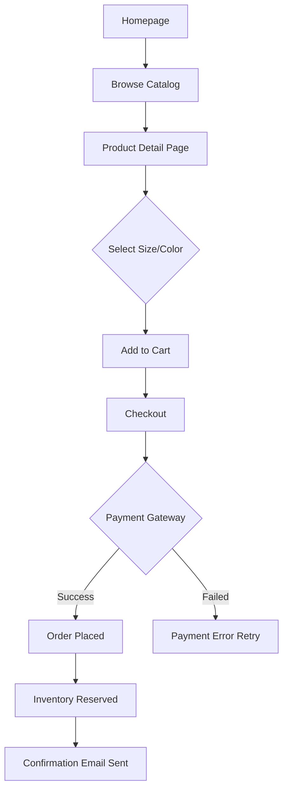
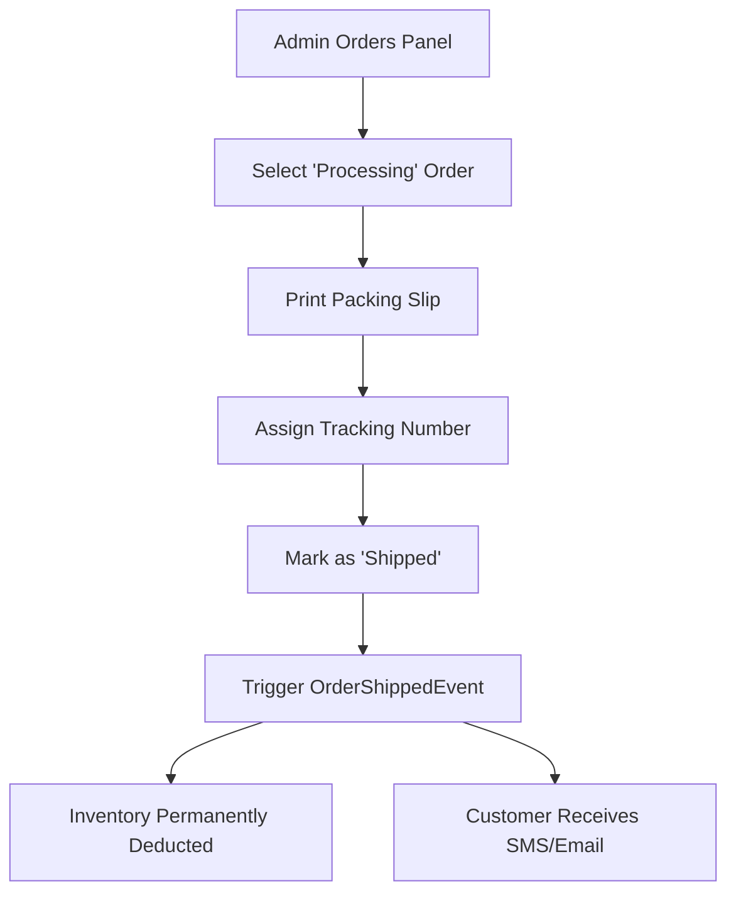
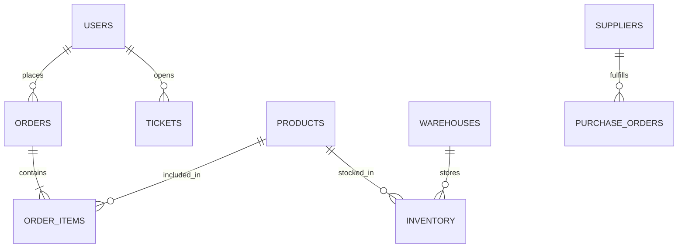

# ATELIER Enterprise Application Blueprint
**Comprehensive Software Requirement Specification (SRS), FRD & TRD**

> [!IMPORTANT]
> This master blueprint defines the complete functional and technical architecture for the ATELIER platform (Storefront + ERP). It serves as the definitive guide for Backend, Frontend, QA, and DevOps teams to build a production-grade system capable of operating alongside platforms like Shopify Plus or Salesforce Commerce Cloud.

---

## PHASE 1: APPLICATION DISCOVERY

### Application Overview
ATELIER is a dual-faceted enterprise e-commerce platform. It consists of a high-performance **B2C Storefront** for luxury fashion retail and an extensive **B2B ERP Admin Portal** for managing global operations, CRM, financials, and supply chains.

### Business Objectives
1. Drive B2C revenue through an optimized, CMS-driven storefront.
2. Centralize back-office operations (PIM, OMS, WMS, CRM) into a single unified ERP dashboard.
3. Provide omni-channel marketing capabilities (Email, SMS) and deep financial reporting.

### User Types
1. **Public Customer:** Browses products, manages cart/wishlist, places orders.
2. **Registered Customer:** Accesses order history, loyalty tier status, and tracking.
3. **Admin Users:** Internal staff (Super Admin, Store Manager, Support Agent, Merchandiser, Finance).
4. **B2B Wholesale Clients:** Managed via the Financials/Invoicing portal.

---

## PHASE 2 & 3: ROUTE & MODULE DOCUMENTATION

### B2C Storefront Routes
| Route | Path | Description | Components |
| :--- | :--- | :--- | :--- |
| **Home** | `/` | Dynamic CMS-driven landing page | `Hero`, `PromoCards`, `Marquee` |
| **Products** | `/products` | Catalog listing with filters | `ProductGrid`, `FilterSidebar` |
| **Product Detail**| `/products/:slug` | Deep-dive product information | `ProductGallery`, `SizeSelector`|
| **Cart** | `/cart` | Shopping cart and promo input | `CartSummary`, `CartItems` |
| **Dashboard** | `/dashboard` | Customer portal (Auth required) | `OrderHistory`, `LoyaltyStatus` |

### ERP Admin Modules
| Module | Path | Core Features | Business Rules |
| :--- | :--- | :--- | :--- |
| **Overview** | `/admin/overview` | Global KPIs, Activity Feed | Cache heavily, refresh every 5m |
| **Products** | `/admin/products` | PIM, Variants, Media, Categories | SKU must be universally unique |
| **Orders** | `/admin/orders` | OMS, Packing Slips, Tracking | Cannot cancel a 'Shipped' order |
| **Customers** | `/admin/customers` | CRM, LTV, Risk Scores, Tags | Emails must be unique |
| **Inventory** | `/admin/inventory` | WMS, Purchase Orders, Suppliers | Stock cannot fall below 0 |
| **Support** | `/admin/support` | Ticketing, SLAs, Live Chat | High priority SLA breached in 2h |
| **Marketing** | `/admin/marketing` | Campaigns, Promo Codes, A/B | Max discount cannot exceed 100%|
| **Financials** | `/admin/financials` | Ledgers, COGS, Tax, B2B Invoices | Invoices must map to an Order |
| **Storefront** | `/admin/storefront` | CMS Layout Builder, SEO | Only 1 'Hero Mood' active at once|
| **Settings** | `/admin/settings` | RBAC, Webhooks, Security | Require 2FA for 'Super Admin' |

---

## PHASE 4: COMPLETE USER FLOW DOCUMENTATION

### 1. Customer Purchase Flow

### 2. Admin Order Fulfillment Flow

---

## PHASE 5: API DOCUMENTATION

*APIs should follow REST v1 standards. Below is a representative subset of critical endpoints.*

### Orders API
*   **`GET /api/v1/admin/orders`**
    *   *Purpose:* Fetch paginated order list.
    *   *Request:* `?status=Processing&page=1&limit=50`
    *   *Response:* `{ data: Order[], meta: Pagination }`
*   **`PATCH /api/v1/admin/orders/:id/status`**
    *   *Purpose:* Update order state.
    *   *Request:* `{ status: "SHIPPED", trackingNumber: "FX123" }`
    *   *Rules:* Requires `write:orders` permission. Must provide tracking if status is `SHIPPED`.

### Inventory API
*   **`POST /api/v1/admin/inventory/transfer`**
    *   *Purpose:* Move stock between warehouses.
    *   *Request:* `{ productId, fromWarehouseId, toWarehouseId, quantity }`
    *   *Rules:* `fromWarehouseId` must have `quantity` >= requested. Transactional.

---

## PHASE 6: DATABASE DOCUMENTATION

**PostgreSQL ER Diagram:**

*   **USERS:** `id` (UUID), `email` (Unique), `password_hash`, `loyalty_points`, `role`.
*   **ORDERS:** `id`, `user_id` (FK), `total`, `status` (Enum), `risk_flag`.
*   **PRODUCTS:** `id`, `sku` (Unique), `name`, `base_price`, `variants` (JSONB).
*   **INVENTORY:** `id`, `product_id` (FK), `warehouse_id` (FK), `quantity_available`.
*   **TICKETS:** `id`, `user_id` (FK), `subject`, `status`, `sla_deadline` (Timestamp).

---

## PHASE 7: RBAC DOCUMENTATION

| Role | Catalog | Orders | Customers | Finance | Settings |
| :--- | :--- | :--- | :--- | :--- | :--- |
| **Super Admin** | Full | Full | Full | Full | Full |
| **Store Mgr** | Full | Full | Read-Only | Read-Only | None |
| **Merchandiser**| Full | None | None | None | None |
| **Support Agent**| Read-Only| Read/Update| Write | None | None |
| **Finance Mgr** | Read-Only| Read-Only | Read-Only | Full | None |

---

## PHASE 8 & 9: BUSINESS RULES & EVENT FLOWS

### Event Driven Architecture (Kafka/RabbitMQ)
1. **`OrderPlacedEvent`**
   * *Producer:* Checkout API
   * *Consumers:* Inventory Service (Locks stock), Notification Service (Sends email), CRM Service (Updates LTV).
2. **`InventoryLowEvent`**
   * *Producer:* Inventory Service (when stock < `lowStockAlert` setting)
   * *Consumers:* Notification Service (Alerts Merchandiser).
3. **`CustomerRegisteredEvent`**
   * *Producer:* Auth API
   * *Consumers:* Marketing Service (Adds to Klaviyo Welcome Flow).

---

## PHASE 10: OPTIMIZATION & BACKEND RECOMMENDATIONS

**Analysis of Current Frontend Architecture:**
The frontend heavily relies on local state (`zustand`) for CMS configs and analytics aggregations.
*   **Missing Backend Requirement 1:** The CMS JSON must be cached via Redis at the Edge (Cloudflare/AWS CloudFront) to achieve sub-50ms TTFB for public users.
*   **Missing Backend Requirement 2:** Analytics calculations (RoAS, CAC, Revenue) must be offloaded to an OLAP database (ClickHouse) via Change Data Capture (Debezium). Running these `SUM()` queries on the primary Postgres database will crash the production server during high-traffic sales.

---

## PHASE 11: SECURITY DOCUMENTATION

1. **Token Strategy:** Short-lived JWTs (15m) + HttpOnly Refresh Tokens (7d).
2. **Session Management:** Redis-backed token blacklist for immediate revocation upon admin ban.
3. **API Security:** Rate limiting on public endpoints (e.g., 5 req/sec on `/checkout`).
4. **Audit Logging:** Every mutating request (`POST`, `PUT`, `PATCH`, `DELETE`) hitting `/api/v1/admin/*` must write an immutable log capturing User ID, IP address, Action, and Timestamp.

---

## PHASE 12: NOTIFICATION DOCUMENTATION

| Trigger | Channel | Audience | Payload Example |
| :--- | :--- | :--- | :--- |
| Order Created | Email | Customer | Order #, Items, Total |
| Order Shipped | SMS & Email| Customer | Tracking Link, Courier |
| SLA Breached | In-App / Slack| Support Mgr| Ticket ID, Agent Name |
| Flash Sale Live| Push Notif | App Users| "Archive Sale is Live!" |

---

## PHASE 13 & 14: DASHBOARD & REPORTING

### Admin Overview Widgets
*   **Total Revenue:** Source (ClickHouse). Calculates SUM of orders where status = `DELIVERED` over `date_range`. Refreshed every 15m.
*   **Active Campaigns:** Source (Postgres). COUNT of campaigns where `status = ACTIVE` AND `end_date > NOW()`. Refreshed real-time.

### Generated Reports
*   **Tax Report:** End-of-month cron job generating a PDF/CSV of tax liabilities aggregated by Shipping State/Country.
*   **Inventory Valuation:** Nightly cron job calculating Total COGS of current stock levels.

---

## PHASE 15: FINAL ARCHITECTURE RECOMMENDATION

For this enterprise scale, we strongly mandate an **Event-Driven Modular Monolith** (or strict Microservices if team size permits).

**Stack Selection:**
*   **App Layer:** Spring Boot 3 or NestJS.
*   **Primary Database:** PostgreSQL 16.
*   **Analytics Database:** ClickHouse.
*   **Caching & Sessions:** Redis ElastiCache.
*   **Event Bus:** AWS MSK (Kafka) or RabbitMQ.
*   **Search Engine:** Elasticsearch (for fast product catalog filtering).
*   **Deployment:** Kubernetes (EKS) for automated scaling during flash sales.
