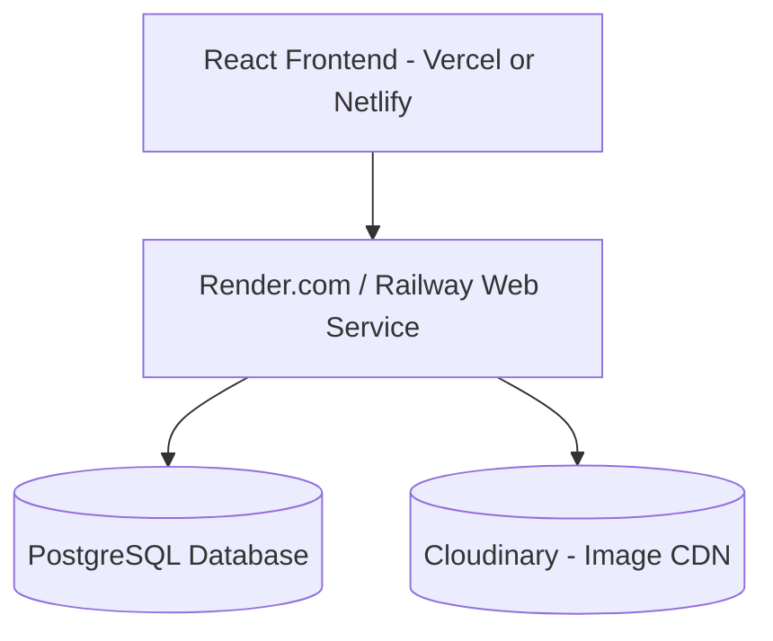

# Simple & Clean Backend Architecture Blueprint (SMB)

> [!TIP]
> **Executive Summary**
> Based on your requirement for a small-scale business, we are building a **Clean Monolithic Backend** using **Node.js, Express, Prisma ORM, and PostgreSQL**. This stack provides the perfect balance of development speed, maintainability, and enough scalability to handle thousands of orders per month.

---

## 1. The Technology Stack

| Component | Technology | Why it's best for a Small Business |
| :--- | :--- | :--- |
| **Language** | TypeScript (Node.js) | Full-stack JS allows frontend and backend devs to share types and context. |
| **Framework** | Express.js | Simple, unopinionated, massive community. |
| **Database** | PostgreSQL | Robust, reliable, and handles JSON data beautifully for flexible product variants. |
| **ORM** | Prisma | Best-in-class developer experience. Makes writing database queries fast and safe. |
| **Authentication** | JSON Web Tokens (JWT) | Stateless and simple. No need for heavy session databases initially. |
| **File Storage** | Cloudinary | Upload product images directly. Handles automatic resizing and CDN delivery. |
| **Hosting** | Render or Railway | Zero-devops platforms. Connect your GitHub repo, and it deploys automatically. |

---

## 2. Monolithic Folder Structure

A simple, layered folder structure keeps business logic decoupled from API routing.

```text
src/
├── controllers/       # Handles HTTP requests/responses
├── services/          # Business logic and algorithms (e.g., ticketService.ts)
├── routes/            # Express route definitions
├── middlewares/       # Auth validation, error handling, RBAC
├── prisma/            # Database schema (schema.prisma) and migrations
└── server.ts          # Entry point for the Express app
```

---

## 3. Simplified Database Design (Prisma Schema)

*Note: I have updated this schema to account for all features in your frontend, including B2B Invoices, Support Tickets, and Multi-Warehouse inventory.*

```prisma
// -- USERS & B2B CLIENTS --
model User {
  id        String   @id @default(uuid())
  email     String   @unique
  password  String
  role      Role     @default(CUSTOMER) // CUSTOMER, ADMIN, SUPPORT_AGENT
  isB2B     Boolean  @default(false)    // True for wholesale clients (e.g. Nordstrom)
  company   String?
  orders    Order[]
  tickets   Ticket[]
  createdAt DateTime @default(now())
}

// -- CATALOG & MULTI-WAREHOUSE INVENTORY --
model Product {
  id          String   @id @default(uuid())
  name        String
  price       Float
  inventory   Inventory[] // One-to-many: Stock per warehouse
  images      String[]
  isPublished Boolean  @default(false)
}

model Warehouse {
  id        String   @id @default(uuid())
  name      String   // e.g. "Main Fulfillment Center"
  location  String
  inventory Inventory[]
}

model Inventory {
  id          String    @id @default(uuid())
  productId   String
  warehouseId String
  quantity    Int
  product     Product   @relation(fields: [productId], references: [id])
  warehouse   Warehouse @relation(fields: [warehouseId], references: [id])
}

// -- ORDERS & INVOICING --
model Order {
  id          String      @id @default(uuid())
  userId      String
  user        User        @relation(fields: [userId], references: [id])
  total       Float
  status      OrderStatus @default(PROCESSING)
  items       OrderItem[]
  invoice     Invoice?    // 1-to-1 relationship for B2B wholesale orders
  createdAt   DateTime    @default(now())
}

model Invoice {
  id        String   @id @default(uuid())
  orderId   String   @unique
  order     Order    @relation(fields: [orderId], references: [id])
  amount    Float
  status    String   // PENDING, PAID, OVERDUE
  dueDate   DateTime
}

// -- CUSTOMER SUPPORT --
model Ticket {
  id        String   @id @default(uuid())
  userId    String
  user      User     @relation(fields: [userId], references: [id])
  subject   String
  status    String   @default("OPEN") // OPEN, PENDING, CLOSED
  priority  String   // LOW, MEDIUM, HIGH
  messages  TicketMessage[]
  createdAt DateTime @default(now())
}

model TicketMessage {
  id        String   @id @default(uuid())
  ticketId  String
  sender    String   // "CUSTOMER" or "AGENT"
  text      String
  createdAt DateTime @default(now())
  ticket    Ticket   @relation(fields: [ticketId], references: [id])
}

enum Role {
  CUSTOMER
  ADMIN
  SUPPORT_AGENT
}
enum OrderStatus {
  PROCESSING
  SHIPPED
  DELIVERED
  CANCELLED
}
```

---

## 4. Handling The Admin Panel Modules (The Simple Way)

Because we are optimizing for a small team, we will simplify how the backend handles the complex Admin features:

### Storefront CMS (Homepage Builder)
- **The Simple Way:** Instead of a complex caching layer, we store the Homepage Configuration as a single JSON object in a PostgreSQL `StorefrontConfig` table. Because it's read frequently, we use a simple in-memory cache variable in the Node.js server.

### Analytics & Financials
- **The Simple Way:** Instead of a separate OLAP database, we perform analytics calculations dynamically using native PostgreSQL aggregations (e.g., `SUM(total) WHERE status = 'DELIVERED'`). Postgres is incredibly fast and can easily handle these queries for a small business.

### CRM & Timelines
- **The Simple Way:** Instead of an Event Bus (Kafka), we simply create a `TimelineEvent` table. Whenever the Node.js `OrderService` updates an order's status, it synchronously writes a new row to the `TimelineEvent` table.

### Background Jobs (Emails)
- **The Simple Way:** We handle non-critical tasks (like sending Order Confirmation emails) asynchronously in memory using Node's event loop, or use a lightweight Node cron job.

---

## 5. Security & Authorization

For a small business, a simplified Role-Based Access Control (RBAC) is sufficient.

1. **Authentication:** When a user logs in, the backend verifies credentials and returns a signed JWT.
2. **Authorization Middleware:**
   We create simple Express middlewares to protect Admin routes.
   ```javascript
   export const requireAdmin = (req, res, next) => {
     if (req.user.role !== 'ADMIN') {
       return res.status(403).json({ error: 'Forbidden' });
     }
     next();
   };
   ```

---

## 6. Deployment Architecture

This architecture is completely "Serverless/PaaS", meaning your team spends 0 hours managing servers.



### Why this is the perfect starting point:
1. **Low Cost:** You can run this entire stack for under $20-$50/month.
2. **High Developer Velocity:** A single full-stack developer can build and maintain this.
3. **Scalable:** If the business explodes in popularity, you can easily upgrade the Postgres instance and scale the Express server horizontally behind a load balancer without rewriting the code.
